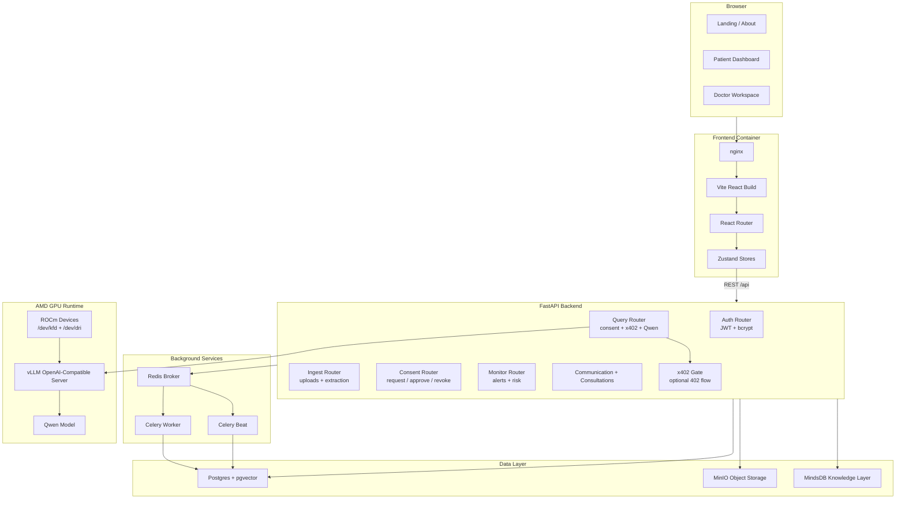
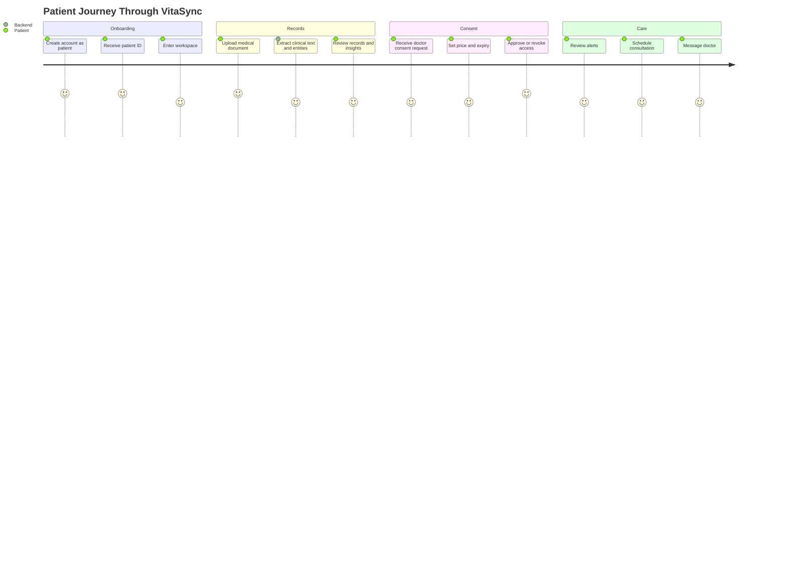
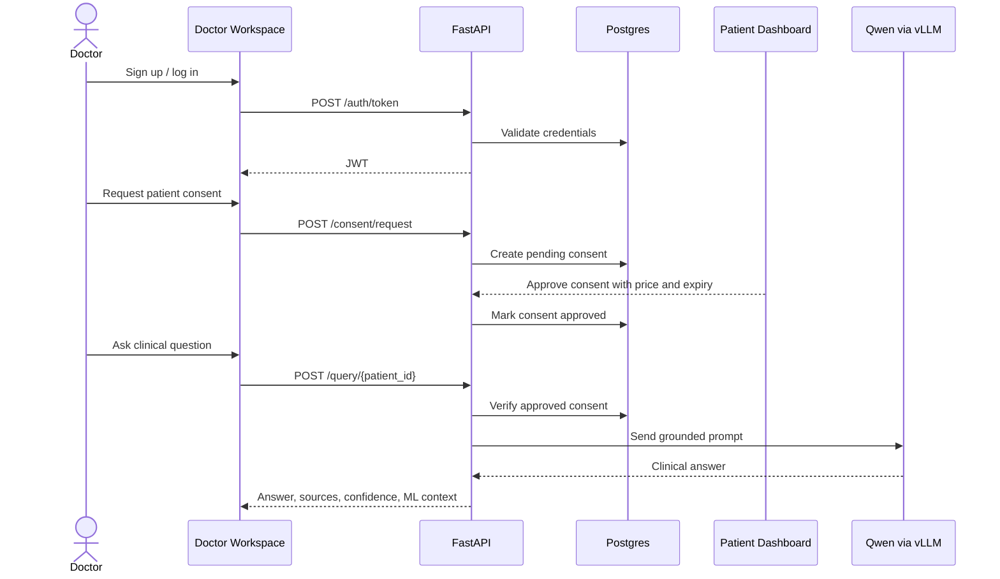
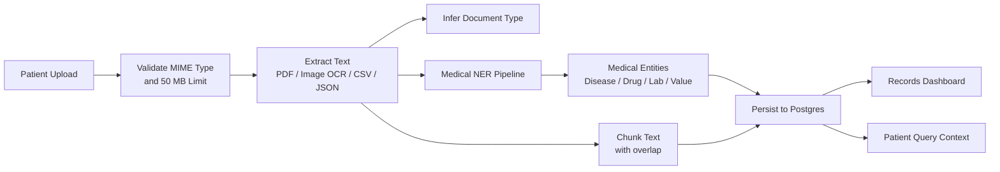
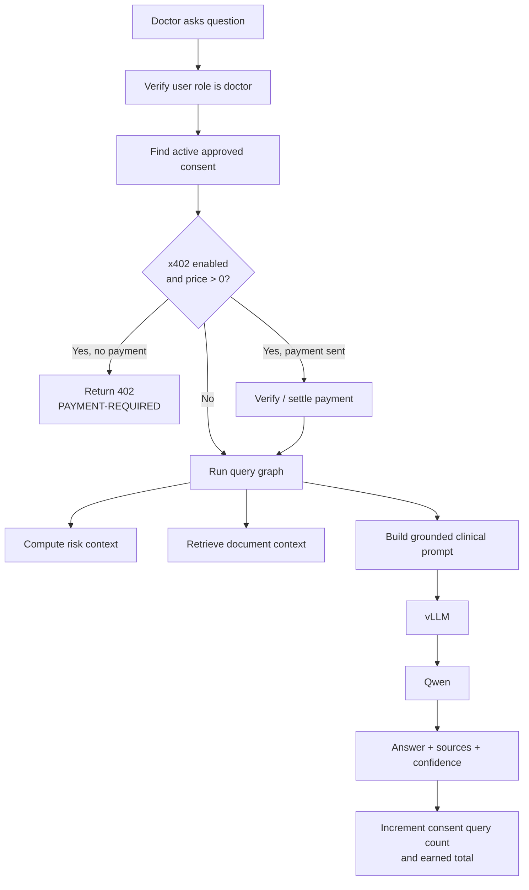
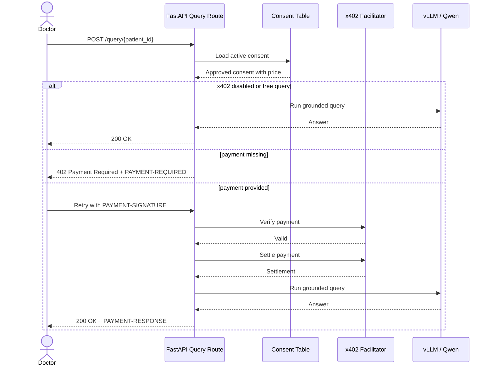
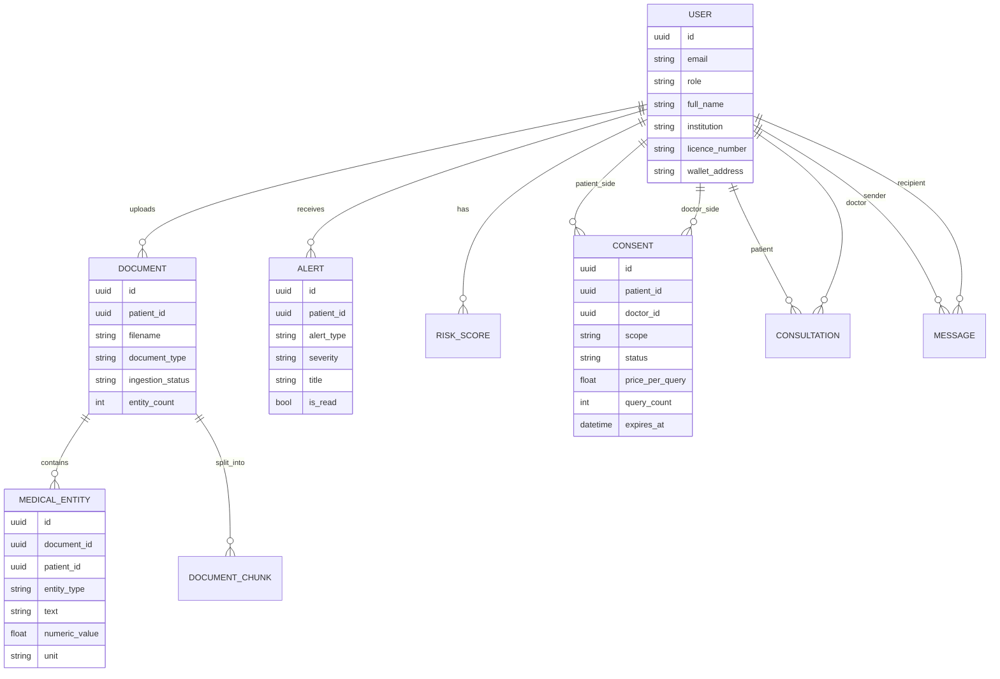

# VitaSync

**Private, AI-native health intelligence for patients and clinicians.**

VitaSync is an open-source, on-premise medical intelligence platform that turns scattered health records into a secure, queryable patient workspace. Patients upload records, review extracted clinical signals, manage consent, and receive alerts. Doctors request consent, pay for approved access when x402 is enabled, and query the patient medical brain through a grounded Qwen-powered workflow running on AMD GPU infrastructure.

The project is designed around a simple idea: medical AI should be useful without asking patients to give up ownership of their data.

## Live Demo & Deployment

- **Frontend**: http://165.245.142.215
- **Frontend (alternate port)**: http://165.245.142.215:8080
- **API Health Check**: http://165.245.142.215:8080/api/health/

> ⚠️ **Demo Only**: This is a demonstration instance. Do not submit real medical data or personal health information.

[](#frontend)
[](#frontend)
[](#backend)
[](#data-layer)
[](#amd-gpu-deployment)
[](#consent-and-x402-payments)

---

## Table Of Contents

- [What VitaSync Does](#what-vitasync-does)
- [Core Capabilities](#core-capabilities)
- [System Architecture](#system-architecture)
- [Patient Journey](#patient-journey)
- [Clinician Journey](#clinician-journey)
- [Document Ingestion Pipeline](#document-ingestion-pipeline)
- [Qwen Query Flow](#qwen-query-flow)
- [Consent And x402 Payments](#consent-and-x402-payments)
- [Data Model](#data-model)
- [Repository Layout](#repository-layout)
- [Technology Stack](#technology-stack)
- [Local Development](#local-development)
- [AMD GPU Deployment](#amd-gpu-deployment)
- [Environment Variables](#environment-variables)
- [Useful Commands](#useful-commands)
- [Production Notes](#production-notes)
- [Troubleshooting](#troubleshooting)
- [Roadmap](#roadmap)
- [License](#license)
- [Disclaimer](#disclaimer)

---

## What VitaSync Does

VitaSync connects three groups of functionality that are usually fragmented across separate tools:

1. **Personal medical record management**: patients upload PDFs, images, CSVs, JSON exports, and other supported medical files.
2. **Clinical intelligence**: the backend extracts text, detects medical entities, chunks records for retrieval, computes risk context, and generates grounded answers.
3. **Consent-controlled clinician access**: doctors cannot query a patient record space unless a patient grants active consent. When x402 is enabled, paid queries are gated by payment requirements and settlement verification.

The result is a patient-owned medical brain: a longitudinal, searchable clinical memory that can be queried by authorized users while keeping deployment under the operator's infrastructure.

---

## Core Capabilities

### Patient Workspace

- Secure patient onboarding and login.
- Patient ID creation from the real database user UUID.
- Medical document upload with file validation.
- Real document text extraction for PDFs, images, CSV, JSON, and text-like files.
- Medical entity extraction and document chunk persistence.
- Dashboard sections for overview, records, insights, consent, alerts, and consultations.
- Copyable patient ID for sharing with clinicians.
- Consent review, approval, revocation, query price, and expiry configuration.
- Alert and monitoring views backed by API data.

### Doctor Workspace

- Doctor onboarding and login with institution, licence number, and optional wallet address.
- Doctor ID creation from the real database user UUID.
- Consent request flow using a patient ID.
- Patient list based on active or pending consent relationships.
- Qwen patient-record querying only after active consent is found.
- Consultation scheduling and doctor messaging flows.
- Prescription and interaction-check workflow.
- Copyable doctor ID for patient/clinical coordination.

### AI And Retrieval

- Grounded query endpoint that validates consent before inference.
- LangGraph-style query workflow for clinical question answering.
- Risk-prediction context injection.
- Document chunk retrieval for patient-specific context.
- vLLM-compatible local inference endpoint.
- Qwen model configuration through environment variables.

### Production Deployment

- Docker Compose stack for local development.
- AMD ROCm Docker Compose stack for MI300X/vLLM deployment.
- nginx-served Vite frontend with SPA fallback.
- FastAPI backend with health checks.
- Postgres with pgvector for structured records and embedding-ready chunks.
- Redis and Celery for asynchronous workers and scheduled monitoring.
- MinIO for object-storage-ready document persistence.
- MindsDB service included for graph/knowledge integrations.
- Optional x402 payment enforcement for paid medical queries.

---

## System Architecture



VitaSync is intentionally service-oriented. The frontend is static after build time, the backend owns business rules, Postgres stores authoritative application state, and Qwen inference is isolated behind vLLM so the model can be swapped or tuned without rewriting the app.

---

## Patient Journey



The patient remains the center of the system. A doctor needs the patient ID to request access, and patient approval is required before any query can run against that patient's records.

---

## Clinician Journey



---

## Document Ingestion Pipeline



Supported upload types are enforced in the backend:

- `application/pdf`
- `image/jpeg`
- `image/png`
- `image/dicom`
- `text/csv`
- `application/json`

The current ingestion router processes files immediately and persists real extraction results. PDF text is extracted with PyMuPDF, image text is extracted with Tesseract OCR, and text-like formats are decoded directly.

---

## Qwen Query Flow



The query route is intentionally strict:

- Only doctors can call the patient query endpoint.
- Doctors must have active consent for that patient.
- If x402 is configured and the approved consent has a non-zero price, the first unpaid request receives `402 Payment Required`.
- Successful paid responses include payment settlement metadata through response headers.

---

## Consent And x402 Payments

VitaSync separates **permission** from **payment**:

1. A doctor requests access to a patient's medical brain.
2. The patient approves the request, sets `price_per_query`, and sets an expiry.
3. The backend treats the consent as the access-control source of truth.
4. If `X402_ENABLED=true` and `price_per_query > 0`, the query route requires an x402 payment before Qwen inference.



Relevant environment variables:

```env
X402_ENABLED=false
X402_PAY_TO=0xYourReceivingWallet
X402_FACILITATOR_URL=
X402_NETWORK=eip155:8453
X402_ASSET=USDC
X402_ASSET_ADDRESS=
```

Leave x402 disabled until you have a real receiving wallet and facilitator configured. With x402 disabled, consent still controls access, but payment enforcement is skipped.

---

## Data Model



The database schema is designed around patient ownership. Most clinical records reference `patient_id`, while access is mediated through `consents`.

---

## Repository Layout

```text
VitaSync/
├── backend/
│   ├── app/
│   │   ├── agents/          # Query and ingestion orchestration
│   │   ├── db/              # Database sessions and MindsDB integration
│   │   ├── llm/             # vLLM client
│   │   ├── ml/              # NER, risk, anomaly, semantic search helpers
│   │   ├── models/          # SQLAlchemy models
│   │   ├── routers/         # FastAPI routers
│   │   ├── schemas/         # Pydantic request/response models
│   │   ├── tasks/           # Celery worker and scheduled tasks
│   │   ├── main.py          # FastAPI application entrypoint
│   │   └── x402.py          # x402 payment requirements and verification
│   ├── Dockerfile
│   └── requirements.txt
├── frontend/
│   ├── src/
│   │   ├── components/      # Shared UI components
│   │   ├── hooks/           # Client hooks
│   │   ├── pages/           # Landing, auth, patient, doctor pages
│   │   ├── stores/          # Zustand state stores
│   │   └── styles/          # Global styles and visual system
│   ├── Dockerfile
│   ├── nginx.conf
│   └── package.json
├── docker-compose.yml       # Local/dev stack
├── docker-compose.amd.yml   # AMD ROCm/vLLM production stack
├── .env.amd.example         # Production env template
└── README.md
```

---

## Technology Stack

### Frontend

- React 19
- TypeScript
- Vite 8
- React Router
- Zustand
- TanStack Query
- GSAP and Framer Motion
- Chart.js
- nginx for production static serving

### Backend

- FastAPI
- SQLAlchemy async ORM
- Pydantic schemas
- JWT authentication
- bcrypt password hashing
- Celery
- Redis
- PyMuPDF and Tesseract-backed extraction
- pgvector-ready document chunks
- vLLM OpenAI-compatible inference client
- x402 payment gate

### Data Layer

- Postgres 16 with pgvector
- Redis
- MinIO
- MindsDB

### GPU Runtime

- AMD ROCm container runtime
- `vllm/vllm-openai-rocm`
- Qwen model configured by `VLLM_MODEL`

---

## Local Development

### Prerequisites

- Docker and Docker Compose
- Node.js 20 or newer
- npm
- Python dependencies are installed inside the backend container

### Start the local stack

```bash
docker compose up -d postgres redis minio mindsdb api celery_worker celery_beat
```

The local compose file runs the backend in development mode with reload enabled.

### Start the frontend

```bash
cd frontend
npm install
npm run dev
```

The Vite dev server defaults to:

```text
http://localhost:5173
```

### Build the frontend

```bash
cd frontend
npm run build
```

The production build is written to:

```text
frontend/dist/
```

Vite produces a small `index.html` plus hashed JavaScript and CSS files under `dist/assets`. That is expected. The nginx container serves `index.html` for SPA routes and serves the real application bundles from `/assets`.

---

## AMD GPU Deployment

The AMD deployment uses `docker-compose.amd.yml`. It starts the full stack, including a ROCm vLLM container connected to `/dev/kfd` and `/dev/dri`.

### 1. Create the production environment file

```bash
cp .env.amd.example .env.amd
```

Edit `.env.amd` and replace every placeholder secret.

### 2. Confirm GPU host access

The AMD compose file expects ROCm-compatible GPU devices:

```text
/dev/kfd
/dev/dri
```

The vLLM service uses:

```yaml
image: vllm/vllm-openai-rocm:latest
devices:
  - /dev/kfd
  - /dev/dri
group_add:
  - video
  - render
```

### 3. Start the production stack

```bash
docker compose --env-file .env.amd -f docker-compose.amd.yml up -d --build
```

### 4. Verify services

```bash
docker compose --env-file .env.amd -f docker-compose.amd.yml ps
curl http://localhost:${FRONTEND_PORT:-80}/api/health/
```

Expected API health response:

```json
{"status":"ok","service":"vitasync-api"}
```

### 5. Access the app

If `FRONTEND_PORT=8080`, the app is available at:

```text
http://YOUR_SERVER_IP:8080
```

If port 80 is free and `FRONTEND_PORT=80`, use:

```text
http://YOUR_SERVER_IP
```

---

## Environment Variables

### Core Production Variables

| Variable | Purpose |
| --- | --- |
| `POSTGRES_DB` | Database name |
| `POSTGRES_USER` | Database user |
| `POSTGRES_PASSWORD` | Required production database password |
| `MINIO_ROOT_USER` | MinIO access user |
| `MINIO_ROOT_PASSWORD` | Required MinIO password |
| `SECRET_KEY` | Required JWT signing secret |
| `CORS_ORIGINS` | Comma-separated frontend origins |
| `FRONTEND_PORT` | Public frontend port |
| `API_PORT` | Public backend port |
| `VITE_API_URL` | Frontend API base, usually `/api` in Docker |

### vLLM Variables

| Variable | Purpose |
| --- | --- |
| `VLLM_MODEL` | Model served by vLLM |
| `VLLM_TENSOR_PARALLEL_SIZE` | Tensor parallel setting |
| `VLLM_DTYPE` | Model dtype, default `float16` |
| `VLLM_MAX_MODEL_LEN` | Maximum context length |
| `VLLM_PORT` | Public vLLM port |

### x402 Variables

| Variable | Purpose |
| --- | --- |
| `X402_ENABLED` | Enables payment enforcement when `true` |
| `X402_PAY_TO` | Receiving wallet address |
| `X402_FACILITATOR_URL` | Facilitator base URL for verify and settle calls |
| `X402_NETWORK` | Chain/network identifier |
| `X402_ASSET` | Payment asset label |
| `X402_ASSET_ADDRESS` | Optional token contract/address |

---

## Useful Commands

### Frontend

```bash
cd frontend
npm run dev
npm run build
npm run lint
```

### Local Docker

```bash
docker compose up -d --build
docker compose ps
docker compose logs -f api
docker compose logs -f frontend
```

### AMD Docker

```bash
docker compose --env-file .env.amd -f docker-compose.amd.yml up -d --build
docker compose --env-file .env.amd -f docker-compose.amd.yml ps
docker compose --env-file .env.amd -f docker-compose.amd.yml logs -f vllm
docker compose --env-file .env.amd -f docker-compose.amd.yml logs -f api
```

### Check Built Frontend Assets

```bash
docker exec vitasync-frontend find /usr/share/nginx/html -maxdepth 2 -type f | sort
```

You should see `index.html`, icons/images, and many files under `/usr/share/nginx/html/assets`.

---

## Production Notes

### Security

- Replace all default passwords before production use.
- Use a long random `SECRET_KEY`.
- Restrict exposed ports with a firewall.
- Put the app behind HTTPS before handling real patient data.
- Keep `X402_ENABLED=false` until a wallet and facilitator are configured.
- Do not log raw medical text or uploaded file contents.
- Rotate credentials after demos or shared deployments.

### Reliability

- Keep Postgres, MinIO, and MindsDB volumes backed up.
- Monitor vLLM startup time. Large Qwen models can take a while before health checks pass.
- Use container health checks before routing traffic.
- Prefer immutable frontend assets with no-cache `index.html` for smoother deployments.
- Track Celery worker logs when ingestion or monitoring appears stuck.

### Privacy

VitaSync is built for on-premise deployment. Records, extracted entities, consent state, and inference traffic can stay inside the deployed infrastructure. Real-world medical use still requires proper compliance review, access policies, audit logging, retention policies, encryption, and operational controls.

---

## Troubleshooting

### "Only index.html is deployed"

That is normal for a Vite single-page app. The full app is deployed as hashed assets under `/assets`, while nginx serves `index.html` for routes like `/dashboard` or `/doctor`.

Check assets:

```bash
docker exec vitasync-frontend find /usr/share/nginx/html/assets -maxdepth 1 -type f | sort
```

### Blank page after deployment

Try:

```bash
docker logs vitasync-frontend
docker logs vitasync-api
curl http://localhost:8080/api/health/
```

Then hard refresh the browser. A stale cached `index.html` can point to old hashed assets after a rebuild.

### API health returns 405 with `curl -I`

The health endpoint expects `GET`, not `HEAD`.

Use:

```bash
curl http://localhost:8080/api/health/
```

### vLLM takes a long time to become healthy

Large models can take significant time to load on GPU. The AMD compose file gives the vLLM health check a long start period. Check logs:

```bash
docker logs -f vitasync-vllm
```

### x402 returns 503

This usually means payment enforcement is enabled but the payment receiver or facilitator is not configured.

Check:

```env
X402_ENABLED=true
X402_PAY_TO=0x...
X402_FACILITATOR_URL=https://...
```

---

## Roadmap

- Full audit log for every record query and consent change.
- Stronger document object persistence through MinIO paths.
- Richer vector search over embedded document chunks.
- Patient-facing payment history for x402 paid queries.
- Admin dashboard for deployment health and service metrics.
- More structured clinical timelines across labs, diagnoses, medications, and visits.
- HTTPS deployment profile with reverse proxy templates.
- Migration-managed schema evolution for production databases.

---

## License

This project is licensed under the MIT License. See [LICENSE](LICENSE) for details.

---

## Disclaimer

VitaSync is software for experimentation, demos, and development. It is not a medical device, does not replace professional clinical judgment, and must not be used as the sole basis for diagnosis or treatment decisions. Production healthcare use requires clinical validation, security hardening, compliance review, and appropriate medical oversight.
