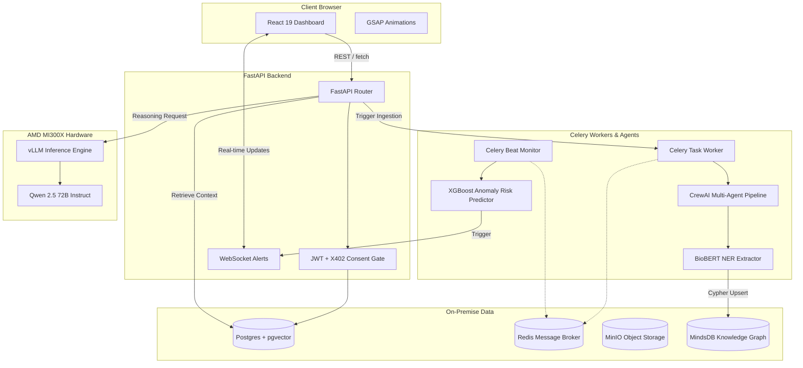

# VitaSync 🧬
*Pure. Honest. Life-saving.*


**VitaSync** is an open-source, on-premise AI health intelligence platform. It unifies a patient's fragmented medical records into a single, queryable, and privately-owned medical brain. Designed for the **AMD Developer Hackathon 2026**, VitaSync utilizes multi-agent AI orchestration, machine learning anomaly detection, and Qwen 72B reasoning running natively on AMD MI300X GPUs via ROCm.

---

## 🌟 Core Features

- **Zero-Cloud Privacy Architecture**: 100% of the patient data, OCR processing, machine learning models, and LLM inference happen locally. Your medical data never touches external third-party cloud servers.
- **X402 Consent Gating**: Cryptographically secure, micropayment-based consent management. Doctors cannot access or query a patient's medical brain unless explicit X402 consent has been granted and paid for.
- **AI-Native Ingestion Pipeline**: Built with CrewAI, VitaSync uses five specialized agents to parse raw PDFs/scans, extract entities via BioBERT, run ML models, and build a Neo4j-compatible Knowledge Graph inside MindsDB.
- **Real-time ML Anomaly Detection**: Uses gradient-boosted ML models (XGBoost) to scan lab results asynchronously. When an anomaly is detected, it computes overall disease risks and fires real-time WebSocket alerts to the dashboard.
- **BrewDistrict24 UI**: A stunning, brutalist-inspired industrial UI using GSAP timelines and 3D card tilts, proving that medical tech doesn't have to look sterile and boring.

---

## 🏛️ Architecture

VitaSync employs a highly decoupled architecture utilizing FastAPI, Celery, and CrewAI orchestrating multiple models asynchronously.



---

## 🚀 Running the Platform

VitaSync runs entirely in Docker. We provide two modes: a lightweight CPU "Dev Mode" and a high-performance "Production Mode" tuned for AMD hardware.

### Prerequisites
- Docker and Docker Compose
- Node.js 20+ (for local frontend development)
- Linux Host with ROCm drivers (`/dev/kfd` and `/dev/dri`) *[Required for AMD Production Mode]*

### Dev Mode (Simulation)
Dev mode mocks the heavy LLM inference and BioBERT pipelines so you can test the UI, PostgreSQL, Redis, and FastAPI endpoints on a standard laptop.

1. Clone the repository:
   ```bash
   git clone https://github.com/Shikhyy/VitaSync.git
   cd VitaSync
   ```
2. Start the backend stack:
   ```bash
   docker-compose up -d postgres redis minio mindsdb api celery_worker celery_beat
   ```
3. Start the frontend:
   ```bash
   cd frontend
   npm install
   npm run dev
   ```

### AMD Production Mode (MI300X ROCm)
This mode uncomments the `vLLM` container, binding directly to your AMD GPU for local 72B parameter inference.

1. Open `docker-compose.yml` and uncomment the `vllm` service.
2. Ensure `DEV_MODE` is set to `"false"` under the `api`, `celery_worker`, and `celery_beat` services.
3. Start the full stack:
   ```bash
   docker-compose up -d
   ```
4. Access the dashboard at `http://localhost:5173`. The backend will automatically route clinical questions to the local vLLM instance.

---

## 🛡️ License

This project is licensed under the MIT License - see the [LICENSE](LICENSE) file for details.

*Built for the AMD Developer Hackathon 2026.*
